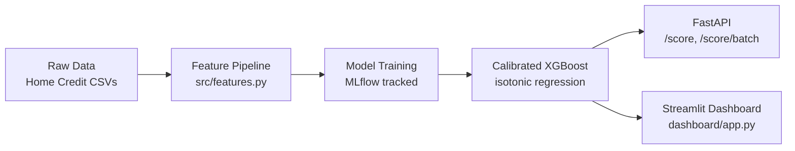
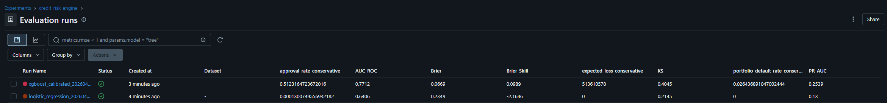

# Credit Risk Decision Engine

End-to-end ML system for loan default prediction and credit decisioning — training, calibration, explainability, policy simulation, serving, and an analyst dashboard in one repo.

---

## Problem statement

Access to credit in emerging markets is gated by the thinness of the formal bureau record: many borrowers have little or no repayment history, so a lender's model has to reason from application-form data, telco/utility proxies, and whatever bureau coverage does exist. The public **Home Credit Default Risk** dataset (~307k applications, ~8.1% default base rate) is a realistic testbed for this problem — it combines sparse external bureau scores (`EXT_SOURCE_*`) with demographics, income, loan structure, document-flag indicators, and social-circle signals.

This project builds a production-shaped decision engine on top of that dataset: from raw CSV to a calibrated classifier, a business-readable risk policy, adverse-action reason codes, a fairness audit, a REST API, and an analyst-facing Streamlit dashboard.

---

## Who this is for

- **Lenders and risk teams** — portfolio simulation with conservative vs moderate approval policies, expected-loss tables, and a threshold tradeoff curve they can tune against their own risk appetite.
- **ML engineers** — a working example of the full lifecycle (feature pipeline → MLflow-tracked training → isotonic calibration → FastAPI inference → Dockerized serving) with clean module boundaries between `features.py`, `train.py`, `policy.py`, `score.py`, and `api.py`.
- **Analysts and compliance reviewers** — a Streamlit dashboard that surfaces model metrics, SHAP-based reason codes, portfolio outcomes, and a gender/education fairness breakdown.

---

## System architecture



---

## Key results

| Metric | Value | Notes |
| --- | --- | --- |
| AUC-ROC | **0.7712** | Test set, stratified 20% holdout |
| KS statistic | **0.4045** | Default / non-default CDF separation |
| Brier score (calibrated) | **0.0669** | Down from 0.1751 raw; see technical highlight below |
| Conservative approval rate | **51.2%** | LOW band only, `p < 0.0649` |
| Default rate among approved | **2.64%** | Conservative policy, test set |
| Approved vs rejected default rate | **2.3% vs 22.7%** | ~10× risk separation at the operational cut-off |

---

## Tech stack


---

## Project structure

```
.
├── configs/
│   └── config.yaml              # thresholds, paths, model hyperparams
├── dashboard/
│   └── app.py                   # Streamlit multipage analyst dashboard
├── data/
│   ├── raw/                     # Home Credit CSVs
│   ├── interim/
│   └── processed/               # engineered training frame
├── models/
│   ├── xgboost_calibrated.pkl   # isotonic-wrapped XGBoost
│   └── feature_medians.json     # imputation for partial records
├── notebooks/
│   ├── 01_eda.ipynb
│   ├── 02_feature_engineering.ipynb
│   ├── 03_modeling.ipynb
│   ├── 04_risk_policy.ipynb
│   ├── 05_explainability.ipynb
│   └── 06_fairness.ipynb
├── reports/
│   ├── calibration_curve.png
│   ├── feature_importance.csv
│   └── model_card.md            # full model card
├── scripts/
│   └── build_dashboard_artifacts.py
├── src/
│   ├── api.py                   # FastAPI inference service
│   ├── config.py
│   ├── features.py              # feature engineering pipeline
│   ├── policy.py                # risk bands, portfolio simulation
│   ├── score.py                 # single + batch scoring, reason codes
│   └── train.py                 # MLflow-tracked training
├── tests/
├── Dockerfile
├── docker-compose.yml
├── Makefile
├── mlruns/                      # MLflow tracking store
├── pyproject.toml
└── requirements.txt
```

---

## Quickstart

```bash
# 1. Clone
git clone <repo-url> credit-risk-decision-engine
cd credit-risk-decision-engine

# 2. Install
python -m venv venv
source venv/bin/activate        # Windows: .\venv\Scripts\Activate.ps1
pip install -r requirements.txt

# 3. Train (runs LR baseline + calibrated XGBoost, logs to MLflow)
python -m src.train
mlflow ui --backend-store-uri ./mlruns   # optional: inspect runs

# 4. Serve the scoring API
uvicorn src.api:app --host 0.0.0.0 --port 8000 --reload
# curl http://localhost:8000/health
# curl http://localhost:8000/model/info
# POST partial applicants to /score; missing fields fill from medians

# 5. Launch the analyst dashboard
streamlit run dashboard/app.py
```

Docker path:

```bash
make docker-build       # builds credit-risk-api:latest
make docker-run         # docker compose up -d (API on :8000)
make docker-stop
```

---

## Live Demo

```bash

[Analyst Dashboard](https://credit-risk-decision-engine-enkhmend.streamlit.app)  
[API Docs](https://credit-risk-decision-engine.onrender.com/docs)  
```

---

### MLflow Experiment Tracking



---

## Technical highlights

1. **Isotonic calibration takes Brier from 0.175 → 0.067.** The raw XGBoost scores over-shoot default probability by a wide margin; a monotone post-hoc calibrator trained with `sklearn.isotonic.IsotonicRegression` preserves feature ranking (so SHAP still explains the base tree) while collapsing calibration error — the reliability diagram in `reports/calibration_curve.png` sits on the diagonal after calibration.
2. **Adverse-action-style reason codes via SHAP.** For every HIGH-band applicant, `src/score.py` runs `TreeExplainer` on the raw XGBoost tree, picks the top-3 positive SHAP drivers, excludes ~15 protected/demographic columns, and formats them through a reason-code template (`"Low external credit score (EXT_SOURCE_MEAN = 0.36)"`) so the output is regulator-ready rather than raw feature values.
3. **Portfolio simulation with threshold tradeoff curves.** `src/policy.py` provides `simulate_portfolio` (Conservative = LOW only; Moderate = LOW + MEDIUM) and `threshold_analysis` (0.05–0.95 sweep of approval rate, portfolio default rate, defaulter recall, F1); both feed the dashboard's Portfolio Analytics page and let risk teams size tradeoffs numerically before changing thresholds.
4. **Fairness audit with FPR/FNR by gender and education.** `notebooks/06_fairness.ipynb` and `data/fairness_metrics.csv` quantify approval-rate, FPR (good rejected) and FNR (defaulter approved) spreads across `CODE_GENDER` and `NAME_EDUCATION_TYPE`, with groups below n=100 filtered out. The Streamlit Fairness Report renders the same numbers for analysts.
5. **Dockerized API with median imputation for partial records.** `src/api.py` builds its Pydantic request schema dynamically from the booster's own feature list, makes every field optional, and imputes absent values from `models/feature_medians.json` at request time — so a client that only knows three or four fields about an applicant can still get a scored decision. The whole stack ships as a ~400 MB Python slim image.

---

## Fairness and limitations

- The model shows measurable approval-rate and error-rate spreads across groups (gender, education). Part of this reflects genuine differences in realised default rate; part reflects correlations between the features the model uses (`EXT_SOURCE_*`, income, employment history) and protected attributes. The audit is **diagnostic**, not a compliance judgment — a disparity here does not by itself establish discrimination.
- Calibration is computed on the test set rather than a separate holdout, which slightly optimistically biases the reported Brier score. A defensible production deployment would calibrate on a dedicated holdout.
- The dataset is Home Credit's public sample; it is not representative of every emerging market — country of origin, product mix, and bureau coverage differ materially across lenders.
- Missingness in `EXT_SOURCE_1` (~56%) is handled with median-impute + a `_missing` flag. This preserves signal but means the model is inferring *through* a systemic coverage gap, which can itself be correlated with demographic groups.
- The model **should not be used as a sole decision-maker**. Human review should cover borderline and MEDIUM-band cases; production use requires legal/compliance sign-off, ongoing stratified monitoring, and a less-discriminatory-alternative search.

---

## Model card

A full model card — intended use, training data, performance breakdowns, fairness caveats, ethical considerations — lives at [`reports/model_card.md`](reports/model_card.md).

---

## Author

Enkhmend Nergui, Math-CS student from Mongolia. Built to address real credit-access challenges in emerging markets with thin bureau infrastructure.